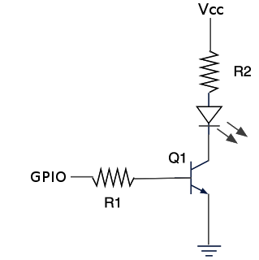

# Daikin Emura
This porject permits to control a **Daikin Emura** using a Raspberry Pi and a IR Led.
In other words, the software emulates the **DAIKIN ARC466A1** remote control.


## IR circuit
IR transmission must be 38Khz, to reach this frequency we use pin 12 (GPIO 18) where we can use (HW) PWM output.

IR led type: 940nm

Schematic:



## Board/OS supported:
  - Raspberry Pi Linux

## Dependencies
  - wiringPi

## Applications an contents
  - daikin_emura: it sends the command to Daikin Emura conditioner
  - cmds_raw: this dir contains all data (raw format) captured using an IR receiver LIRC (sudo mode2 -d /dev/lirc0 -m > <file>)
  - decode: it converts the raw data (LIRC capture) in a bit stream (see the cmds dir content after the make)
  - compare: it compares two or more files generated by "decode", in this way it is simple to see what are the bits used for single command (button)

## Compare two commands
To compare the On/Off command it is sufficient to run: `./compare cmds/daikin_onoff_on cmds/daikin_onoff_off`

Its output is:
```
00000.[1000100001011011111001000000000010100011000010000000000011100111][1000100001011011111001000000000001000010000101010011000000010000][10001000010110111110010000000000000000001001000000111100000000000000110000000000000000000110000000000110000000000000000010000011000000010000000001110100] <- cmds/daikin_onoff_on
00000.[1000100001011011111001000000000010100011000010000000000011100111][1000100001011011111001000000000001000010000101010011000000010000][10001000010110111110010000000000000000000001000000111100000000000000110000000000000000000110000000000110000000000000000010000011000000010000000010110100] <- cmds/daikin_onoff_off
                                                                                                                                                                                   *                                                                                                       **       
                                                                                                                                                                                   *                                                                                                       **       
12345  |1234567|1234567|1234567|1234567|1234567|1234567|1234567|1234567| |1234567|1234567|1234567|1234567|1234567|1234567|1234567|1234567| |1234567|1234567|1234567|1234567|1234567|1234567|1234567|1234567|1234567|1234567|1234567|1234567|1234567|1234567|1234567|1234567|1234567|1234567|1234567|
       | B 0   | B 1   | B 2   | B 3   | B 4   | B 5   | B 6   | B 7   | | B 0   | B 1   | B 2   | B 3   | B 4   | B 5   | B 6   | B 7   | | B 0   | B 1   | B 2   | B 3   | B 4   | B 5   | B 6   | B 7   | B 8   | B 9   | B 10  | B 11  | B 12  | B 13  | B 14  | B 15  | B 16  | B 17  | B 18  |
       | 0x11  | 0xDA  | 0x27  | 0x0   | 0xC5  | 0x10  | 0x0   | 0xE7  | | 0x11  | 0xDA  | 0x27  | 0x0   | 0x42  | 0xA8  | 0xC   | 0x8   | | 0x11  | 0xDA  | 0x27  | 0x0   | 0x0   | 0x8   | 0x3C  | 0x0   | 0x30  | 0x0   | 0x0   | 0x6   | 0x60  | 0x0   | 0x0   | 0xC1  | 0x80  | 0x0   | 0x2C  |
```
Where the first lines are the bits transmitted with the commands. The lines with '*' show the bits changed (marked with *) from two commands.
The last three lines are respectively:
  - the bit sequence (byte per byte)
  - the byte sequence
  - the constant byte value among the commands compared
  
## License
GNU AFFERO GENERAL PUBLIC LICENSE
This program is free software: you can redistribute it and/or modify
it under the terms of the GNU Affero General Public License as
published by the Free Software Foundation, either version 3 of the
License, or (at your option) any later version.

This program is distributed in the hope that it will be useful,
but WITHOUT ANY WARRANTY; without even the implied warranty of
MERCHANTABILITY or FITNESS FOR A PARTICULAR PURPOSE.  See the
GNU Affero General Public License for more details.

You should have received a copy of the GNU Affero General Public License
along with this program.  If not, see <http://www.gnu.org/licenses/>.
